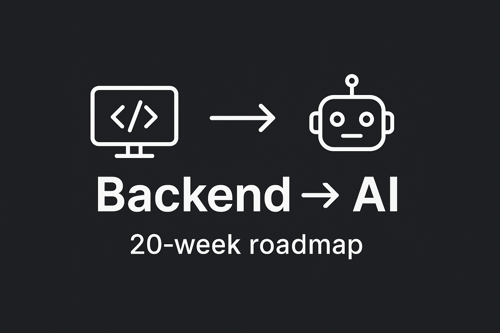

# 🚀 Backend to AI

*From backend developer to AI engineer: a 20-week roadmap with notes, projects, and interview prep.*

<p align="center">
  
</p>


This repo documents my **structured learning journey (Oct 2024 – Feb 2025)** as I transition from a decade of backend/API development into **AI engineering**.  
It includes weekly notes, hands-on projects, and interview preparation material.

---

## 📅 Roadmap
This learning journey follows a week-by-week plan (20 weeks):

- **Weeks 1–4 (Oct 2024):** Python & AI Basics  
- **Weeks 5–8 (Nov 2024):** NLP & GenAI Fundamentals  
- **Weeks 9–12 (Dec 2024):** GenAI Projects & Agentic AI  
- **Weeks 13–16 (Jan 2025):** Interview Prep + Portfolio Polish  
- **Weeks 17–20 (Feb 2025):** Stretch Goals (Deep Learning, PyTorch)

👉 Detailed notes are in [`weeks/`](./weeks/)

---

## 📂 Repository Structure

``` perl
backend-to-ai/
│
├── README.md               # Overview of your roadmap, links to key projects
│
├── weeks/                  # Notes per week
│   ├── week-01/            
│   │   ├── notes.md        # Summary of what you learned
│   │   └── code/           # Any small scripts or exercises
│   │       ├── json_csv_parser.py
│   │       └── ...
│   │
│   ├── week-02/
│   │   ├── notes.md
│   │   └── code/
│   │
│   ├── ... up to week-20
│
├── projects/               # Bigger hands-on projects
│   ├── titanic-analysis/
│   │   ├── notebook.ipynb
│   │   ├── README.md
│   │   └── data/           # Keep small sample datasets (if allowed)
│   │
│   ├── pdf-qa-bot/
│   │   ├── app.py
│   │   ├── requirements.txt
│   │   └── README.md
│   │
│   └── multi-agent-assistant/
│       ├── crewai_demo.py
│       ├── README.md
│       └── ...
│
└── interview-prep/          # Dedicated section for Jan/Feb prep
    ├── ml-basics.md         # regression, classification notes
    ├── genai-concepts.md    # embeddings, RAG, LLMs
    ├── system-design.md     # AI API/system design notes
    └── behavioral.md        # STAR-method answers

```
## 🚀 Key Projects
- [Titanic Data Analysis](./projects/titanic-analysis) — Pandas, Matplotlib, data wrangling  
- [PDF Q&A Bot (RAG)](./projects/pdf-qa-bot) — LangChain, ChromaDB, embeddings  
- [Multi-Agent Research Assistant](./projects/multi-agent-assistant) — CrewAI, LangGraph, Agentic AI  

Each project folder includes:
- `README.md` with overview & instructions  
- Source code / notebooks  
- Example outputs or demo links  

---

## 📝 Weekly Notes
Each week’s folder includes a `notes.md` covering:
- ✅ Topics covered  
- ❌ What I skipped  
- 🔑 Key insights  
- 🎯 Focus for next week  

Find them all in [`weeks/`](./weeks/).

---

## 🎯 Interview Prep
Dedicated section for interview preparation: [`interview-prep/`](./interview-prep/)  
- **ML Basics**: regression, classification, evaluation  
- **GenAI Concepts**: embeddings, RAG, LLMs, LangChain  
- **System Design**: designing AI-powered APIs  
- **Behavioral**: STAR-method answers  

---

## 📌 Progress Tracking
I’m also tracking this roadmap in **Notion**, with:
- Weekly tasks and checklists  
- Project milestones  
- Interview Q&A  

---

## 🙌 Connect with Me
- LinkedIn: [Your LinkedIn Profile](https://linkedin.com/in/yourname)  
- GitHub: [Your GitHub Profile](https://github.com/yourusername)  

---

⭐️ If you’re also transitioning from backend to AI, feel free to fork this repo, follow along, or connect with me!

